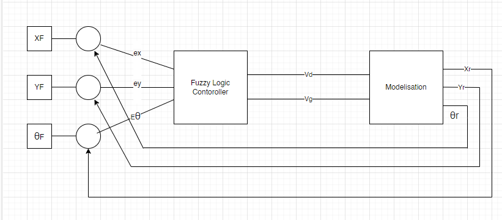
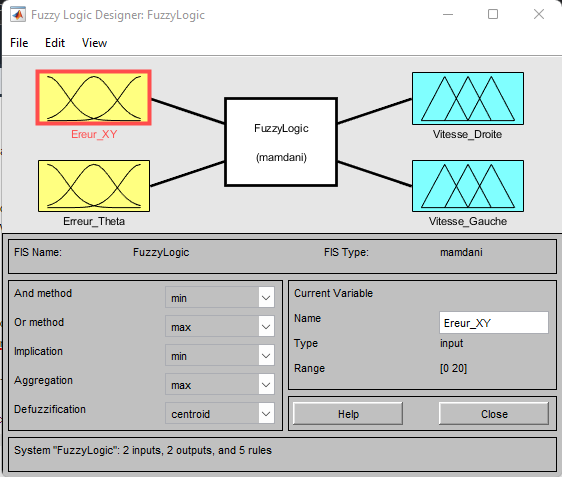
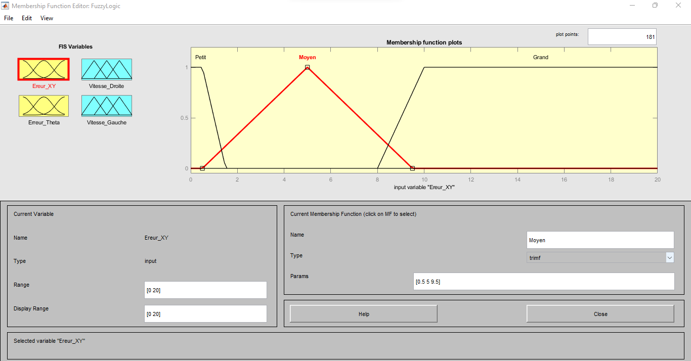
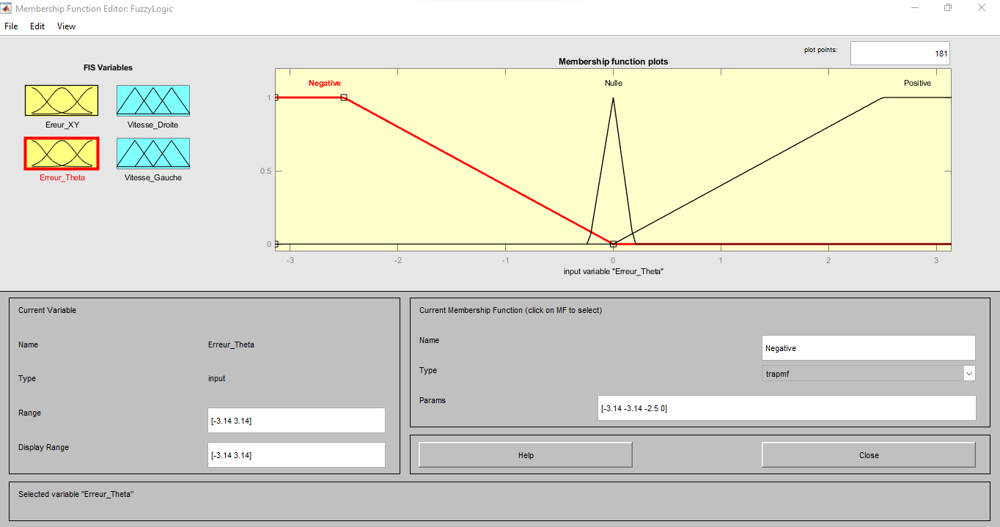
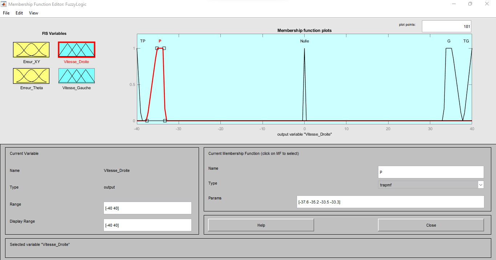
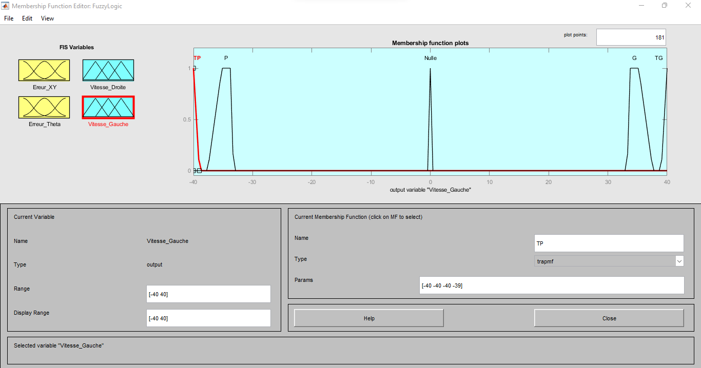

<h1 align="center">Controlling a Differential-Drive Mobile Robot Using Fuzzy Logic.</h1>

<h1 align="center">Abstract</h1>

The objective of this project is to create a fuzzy controller for a differential drive robot. The aim is to familiarize ourselves with fuzzy logic and to explore the capabilities of Simulink.The project involves modeling the kinematics of the robot in a block and linking it to a block of fuzzy logic. The robot has two speeds, which are both the outputs of our fuzzy controller and the inputs for the robot model. Our system is looped : we initially provide the positions
that the robot should reach, these positions enter a subtract block along with the estimated model measurements to provide errors that are used as inputs for the fuzzy controller. According to the rules and inference used, the controller provides the necessary speeds for the robot to navigate towards the destination. The robot will reach its destination when the errors cancel each other out.

<h1 align="center">General Project Description</h1>

The project involves creating a fuzzy controller that commands a differential drive robot. The overall goal of this project is to construct two general blocks using Simulink: one to implement the file containing the fuzzy logic and one to model the robot. At the outset, the user must provide the destination coordinates (X, Y) and specify the orientation (Theta) of the robot. Each time, the system calculates the error between the arrival point and the estimated point. It calculates the error in both the x and y directions and then squares the sum of these errors. Simultaneously, it calculates the error in Theta. In the end, there are two inputs for the fuzzy logic block: one for Theta and the other for XY. Using the fuzzy controller rules and membership functions, the system provides two outputs: the left wheel speed and the right wheel speed of the robot. These speeds are also inputs for the modeling block. Finally, the system traces the robot's trajectory until the errors converge to zero.The figure below provides a general overview of how the system operates:

  

<h1 align="center">The fuzzy logic block (Project.fis)</h1>

The figure below shows the inputs and outputs along with the Mamdani reference of our fuzzy system:

  

<h2>The Inputs of the FLC</h2>
Our fuzzy system has two inputs:
<ul>
  <li>Error in the XY direction.</li>
 <li>Error in the Theta direction.</li>
</ul>

<h3> Error in the XY Direction</h3>
The figure below illustrates the configured parameters:

<ul>
  
 <li>The universe of discourse ranges from 0 to 20.
  </li>
 <li>We have chosen to use three membership functions: two trapezoidal functions located at the extremes to cover the entire universe of discourse and one triangular function.</li>
 <li>The first trapezoidal function has the following parameters: [0 0 0.5 1.5], representing the range of error where it is small.</li>
 <li>The second trapezoidal function has the following parameters: [8 10 20 20], representing the range of error where it is large.</li>
 <li>The triangular function represents the range of error where it is medium and is characterized by the following parameters: [0.478 4.98 8.48].</li>
 <li>As you can see, the intersection between the functions does not exceed 25 percent of the range of each function.</li>
 
</ul>

  

<h3>Error in the Theta Direction</h3>
Now, let's explain the error in the Theta direction based on the figure representing the Theta error:
<ul>
  <li>The universe of discourse ranges from -3.14 to 3.14 (representing radians).</li>
  <li>We have chosen to use three membership functions: two trapezoidal functions located at the extremes to cover the entire universe of discourse and one triangular function.</li>
  <li>The first trapezoidal function has the following parameters: [-3.14 -3.14 -2.5 0], representing the range of error where the angle of orientation is negative.</li>
  <li>The second trapezoidal function has the following parameters: [0 2.5 3.14 3.14], representing the range of error where the angle of orientation is positive.</li>

  <li>The triangular function represents the range of error where the angle of orientation is zero and is characterized by the following parameters: [-0.2243 0 0.191].</li>
<li>As you can see, the intersection between the functions does not exceed 25 percent of the range of each function.</li>
</ul>

  

<h2>The Outputs of the FLC</h2>
Our fuzzy logic controller (FLC) has two outputs:

<ul>
  <li>  Right Wheel Speed.</li>
  <li>Left Wheel Speed.</li>
</ul>

<h3>Right Wheel Speed</h3>

The figure below illustrates the configuration used for the right wheel speed output:
<ul>
  <li>The universe of discourse ranges from -40 to 40.</li>
  <li>Five membership functions are chosen: four trapezoidal functions - two at the extremes to cover the universe of discourse, two representing small and large speeds, and one triangular function.</li>
  <li>The first trapezoidal function has the following parameters: [-40 -40 -40 -39], representing the range of right wheel speed where it is very small.</li>
  <li>The second trapezoidal function has the following parameters: [-37.6 -35.2 -33.5 -33.3], representing the range of right wheel speed where it is small.</li>
  <li>The triangular function represents the range of right wheel speed where it is zero and is characterized by the following parameters: [-0.2 0 0.2].</li>
  <li>The third trapezoidal function has the following parameters: [33.3 33.5 35.2 37.6], representing the range of right wheel speed where it is large.</li>
    <li>The fourth trapezoidal function has the following parameters: [38 40 40 40], representing the range of right wheel speed where it is very large.
</li>
    <li>As you can see, the intersection between the functions does not exceed 25 percent of the range of each function.
</li>

</ul>

  

<h3>Left Wheel Speed </h3>

The figure below explains the configuration for the left wheel speed output:
<ul>
  <li>The universe of discourse ranges from -40 to 40.</li>
    <li>Five membership functions are chosen: four trapezoidal functions - two at the extremes to cover the universe of discourse, two representing small and large speeds, and one triangular function.
</li>
  <li>The first trapezoidal function has the following parameters: [-40 -40 -40 -39], representing the range of left wheel speed where it is very small.
</li>
  <li>The second trapezoidal function has the following parameters: [-37.6 -35.2 -33.5 -33.3], representing the range of left wheel speed where it is small.
</li>
  <li>The triangular function represents the range of left wheel speed where it is zero and is characterized by the following parameters: [-0.2 0 0.2].
</li>
  <li>The third trapezoidal function has the following parameters: [33.3 33.5 35.2 37.6], representing the range of left wheel speed where it is large.
</li>
<li>The fourth trapezoidal function has the following parameters: [38 40 40 40], representing the range of left wheel speed where it is very large.
</li>
  <li>As you can see, the intersection between the functions does not exceed 25 percent of the range of each function.
</li>
</ul>

</ul>

  

